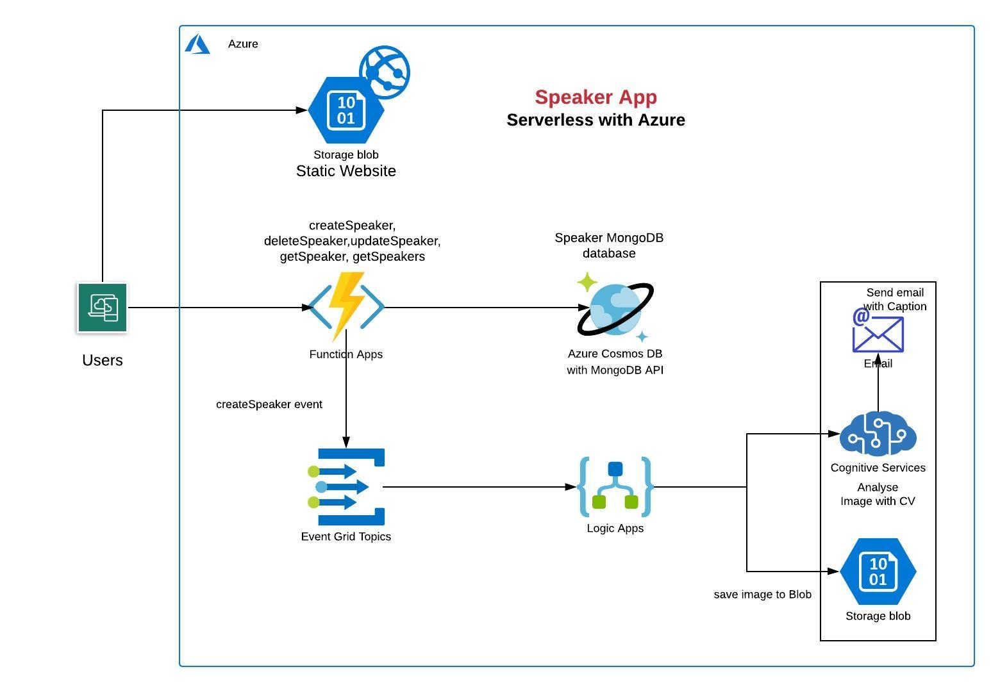

# Azure-Serverless
This repository contains Azure Serverless projects.

## SpeakerApp Details
SpeakerApp provide a plateform track all the speakers along with their skill set and provide notification when a speaker is being added into the system. System also anlaysed the speaker photo and provide image captions.

### Azure Services:
- Azure Functions
- Event Grid
- Logic Apps
- Congnitive Service (Computer Vision for Caption)
- CosmosDB
- Azure Storage

### Architecture

